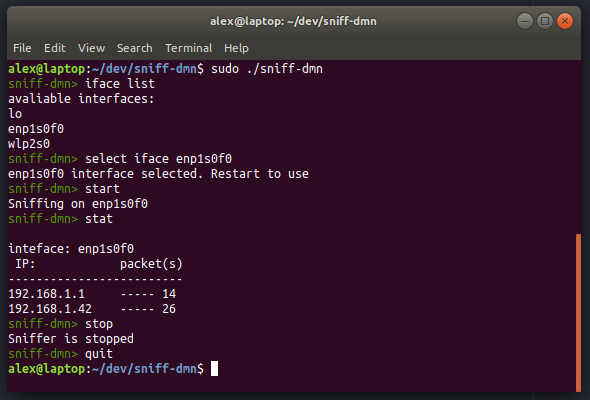

# sniff-dmn

Service that collects statistic about incoming IP-packets written in C language.

The program consists of two processes. Shell precess and daemon process. Shell process is used for CLI (Command Line Interface) and another one is used to sniffs IP-packets in background. Processes communicate to each other through non-blocking UNIX socket. During execution program stores statistics from different interfaces in list of binary search trees BSTs, so time complexity for IP search at average is log(N). When daemon stops statistic is stored in the root directory. The next time you start sniffer, it will load statistic from file to list of BSTs. By default it starts on wired interface with lowest serial number;

Commands:

- **start**  -  start sniffing from from default iface(eth0)
- **stop** - stop sniffing packets
- **show [ip] count** - print number of packets recieved from ip address
- **select iface [iface]** - select interface for sniffing
- **stat [iface]** - show statistics for particular interface, if iface ommited - for all ifaces
- **iface list** - show interface list
- **quit**, **q** - exit sniff-dmn
- **--help** - show usage information

